ex3:
 post :http://localhost:8081/etudiants

get :http://localhost:8081/etudiants

get :http://localhost:8081/etudiants/2

)

put :http://localhost:8081/etudiants/2

delete:http://localhost:8081/etudiants/2

ex4:

get :http://localhost:8081/etudiants/recherche?nom=ben

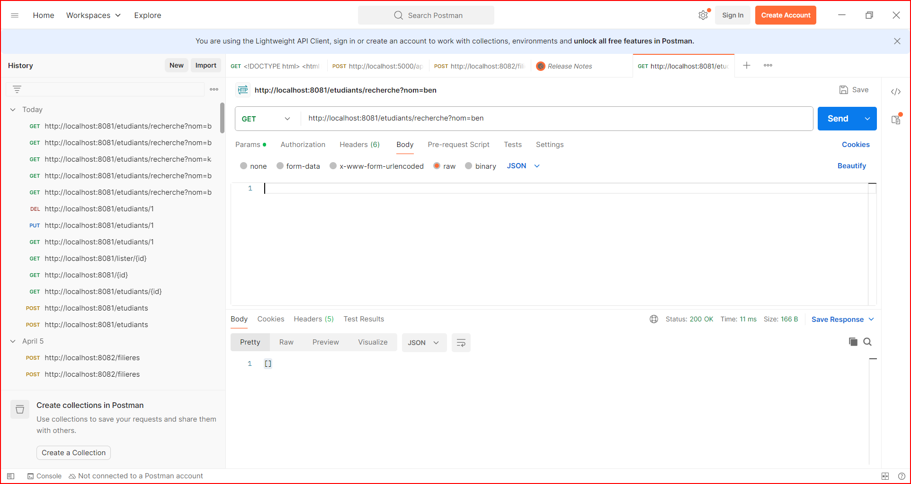

get:http://localhost:8081/etudiant/groupe?groupe=DSI2

get: http://localhost:8081/etudiant/admis?seuil=10

get 1:http://localhost:8081/etudiant/meilleurs?seuil=14

post:http://localhost:8081/etudiant
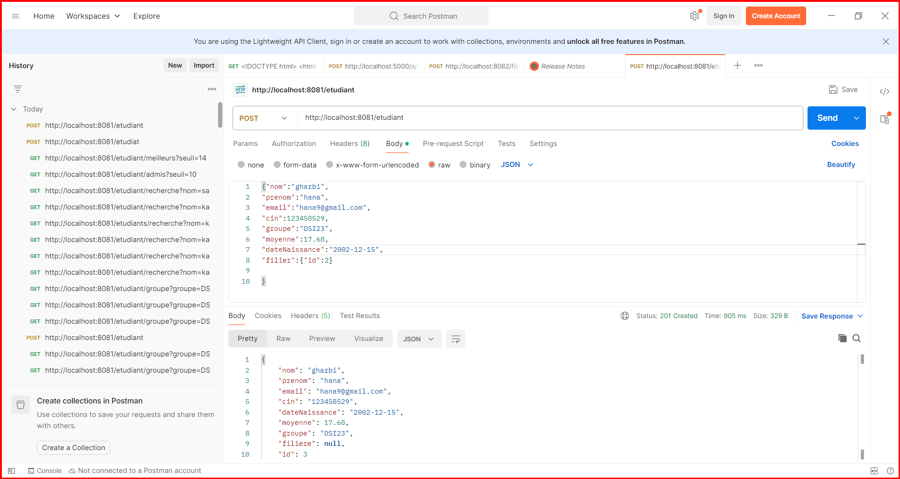
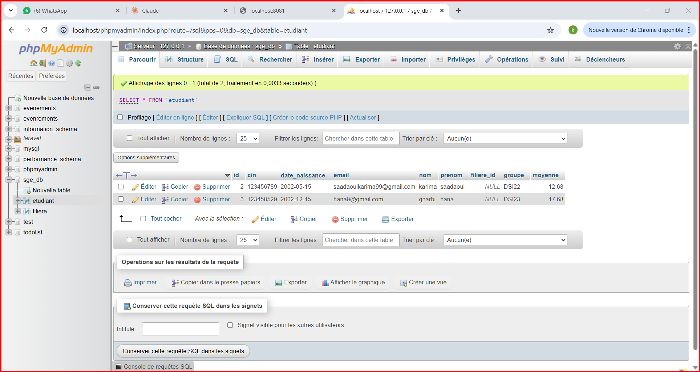
get 2:http://localhost:8081/etudiant/meilleurs?seuil=14
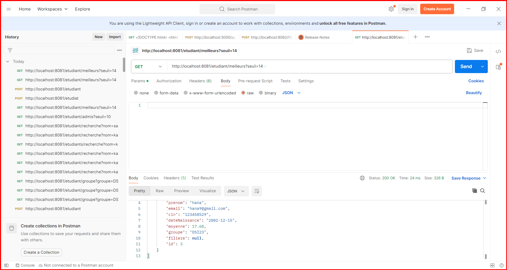

ex5 :
post : http://localhost:8081/modules
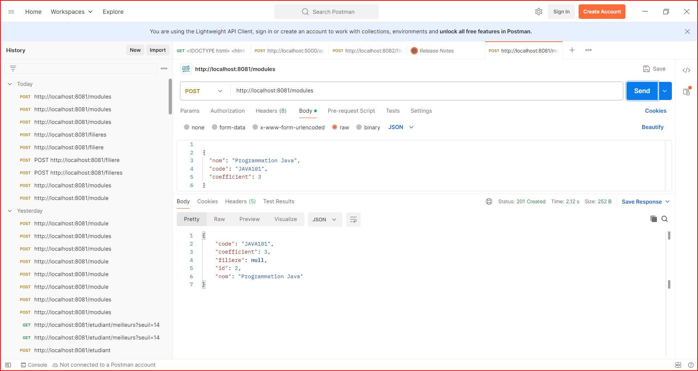

get: http://localhost:8081/modules

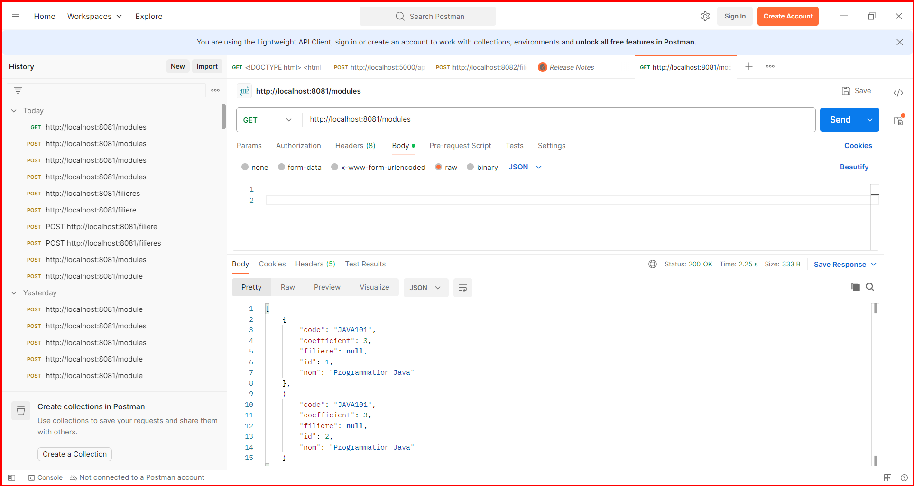

get par id:http://localhost:8082/modules/2/etudiant
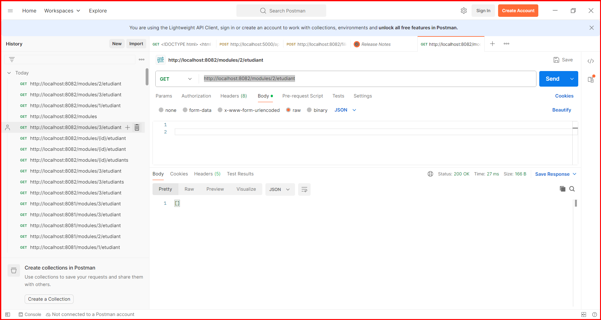

delete : http://localhost:8082/modules/2
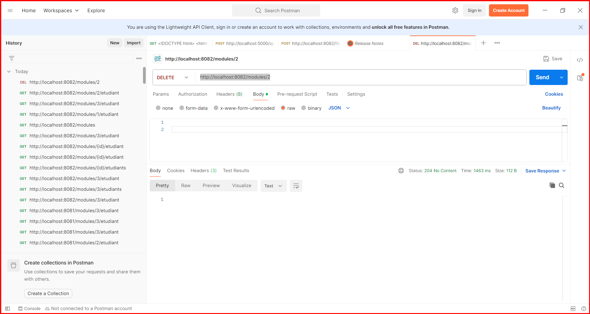

ex6:
get :http://localhost:8082/etudiant/page?page=0&size=2&sortBy=moyenne

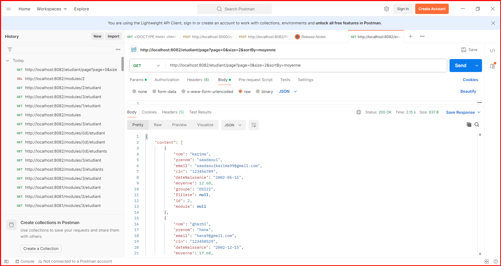 resultat partie1

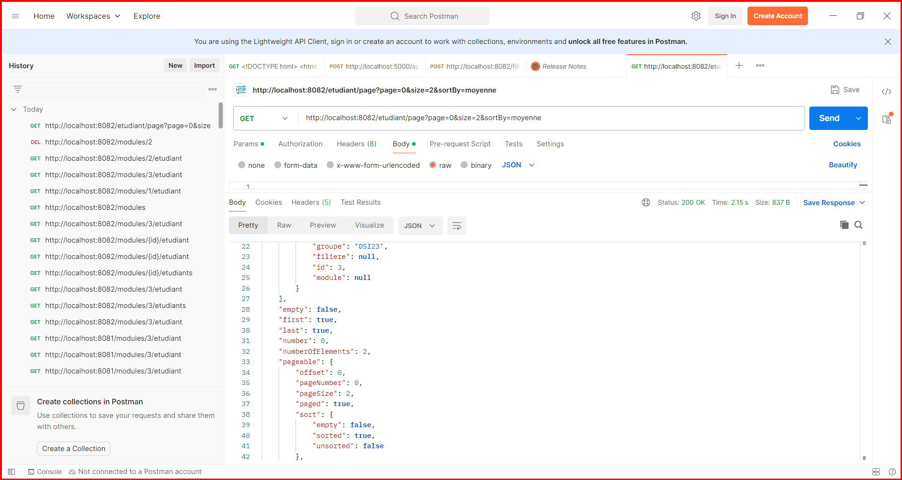 resultat partie2

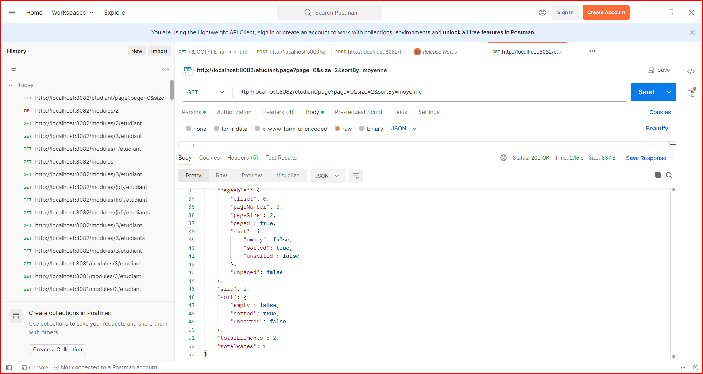 resultat partie 3

